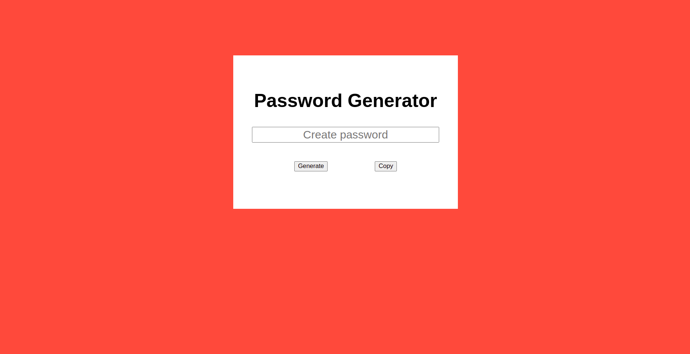

# passwordGenerator

**[Test this app yourself](github.io)**

---

#### Navigation

- About Project
  - _Description_
  - _Developed With_
- How to use this Project
  - _Description_
  - _Developed With_
- Contact
  - _Mail_
  - _GitHub_
  - _LinkedIn_
- Used Tools
  - _Fonts_
  - _Design_
  - _Icons_
  - _Colors_

---

### About Project

A password generator created using HTML and JavaScript.

### How to use this Project

You can easily generate a 12 digit password by clicking on the "Generate" button. Then you can click on the "Copy" button to copy the password and use it whenever and wherever you need it.

##### Developed With

- [x] _HTML5_
- [ ] _CSS3_
- [ ] _SASS_
- [ ] _SCSS_
- [x] _JavaScript_
- [ ] _React_
- [ ] _Bootstrap_
- [ ] _npm_
- [ ] _..._

---

### Contact

Mail: <penninoematita@gmail.com> 
GitHub: [vincenzoarena](https://github.com/vincenzoarena) 
LinkedIn: [Vincenzo Arena](https://www.linkedin.com/in/vincenzo-arena-032a064b/)

---

### Used Tools

- [Visual Studio Code](https://code.visualstudio.com/)

---